# 第2章 图象数字化

## 1. 成像过程

- 视觉过程（光学过程、化学过程、神经处理过程）
  
  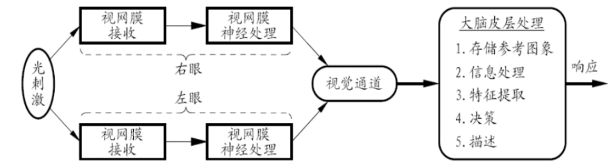

- 成像变换
  齐次坐标透视变换、逆投影变换

- 成像亮度    $f(x,y)=i(x,y)r(x,y)$

- 视觉系统
  人类视觉系统对亮度变化的感知比对亮度本身要敏感
  人类视觉系统对光强度的响应不是线性的，而是对数形式的（对暗光时亮度的增加比对亮光时亮度的增加更敏感）

## 2. 采样和量化：原理及产生的效果

空间采样与幅度采样

## 3. 像素间关系，连通悖论，距离测度

欧式距离（ $L_2$ 范数）、城区距离（ $L_1$ 范数、 $D_4$ ）、棋盘距离（ $L_\infty$ 、 $D_8$ ）

## 4. 图像网格采集效率

单位圆面积积与覆盖该单位圆的网格面积之比
六边形采样效率最高

## 5. 数字弦、紧致弦的判定方法

数字弧：$p\rightarrow q$ 连续
数字弧：$d_8(\rho,p_k)<1$
紧致数字弧：$d_4(\rho,p_k)<1$

## 6. 2D距离变换

# 第3章 图像变换

## 1. 可分离和正交图像变换定义

## 2. 2D DFT变换及其基本性质

## 3. KL变换原理 <mark>?</mark> $P182$

KL变换是建立在统计特性基础上的一种变换

- 一种特征提取方法

- 最小均方误差意义下的最优正交变换

- 在消除模式特征之间的相关性、突出差异性方面有最优的效果

# 第4章 形态学

## 1.  二值形态学

腐蚀 $\ominus$ 、 膨胀 $\oplus$
开启（先腐蚀，再膨胀）、闭合（先膨胀，再腐蚀） 
击中击不中：定义，对偶性，几何解释
组合运算（区域凸包、细化、利用细化进行粗化、剪切）
实用算法原理

- 噪声滤除（先开后闭）

- 目标检测 （击中击不中变换）

- 边界提取（先腐蚀再作差）

- 区域填充（内部取一点，按模板膨胀，取交集迭代）

- 连通组元提取<mark>?</mark>p232

- 区域骨架提取<mark>?</mark>

# 第5章 图像增强

## 1. 图像增强和图像恢复的区别

- 相同点：在某种意义上改善给定图像的视觉效果，有部分内容是相通的。  

- 不同点：
  
  1. 图像恢复可利用退化现象的某种先验知识（退化模型），把退化的图像加以重建和恢复。这种技术需要弄清楚退化的原因，进行数学建模，再沿着图像降质的逆过程恢复图像。图像增强技术对图像的退化或降质的过程基本上不进行建模，只追求较好的满足需要的视觉效果。
  
  2. 图像恢复技术有明确规定的质量标准，这样可以对恢复的图像给出最佳的评估。图像增强技术是一种人的心理接受过程，一般没有客观和统一的评价标准。
  
  3. 图像增强”是一个启发式过程，目的是处理后的图像有利于人眼系统的观察图像内容。图像恢复”是根据某最优准则，使得恢复后的图像是对理想图像的最佳逼近。

## 2. 空域灰度变换

- 基本灰度变换
  灰度映射$s=T(r)$ 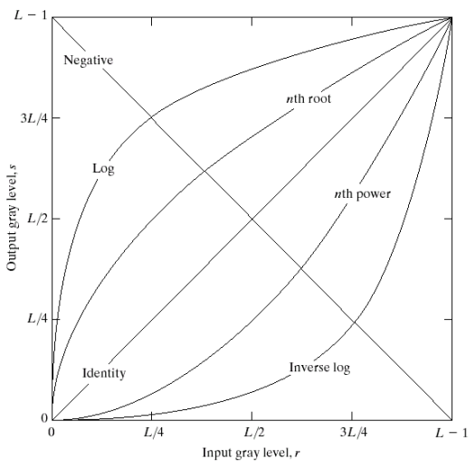

- 直方图处理（直方图均衡、直方图匹配、局部直方图处理）

## 3. 空域滤波

- 基本定义

- 空域平滑：局部平均、中值滤波、保边滤波（双边滤波：像素值差越小、距离越近，则权重越大）

- 空域锐化：一阶算子、二阶算子
  
  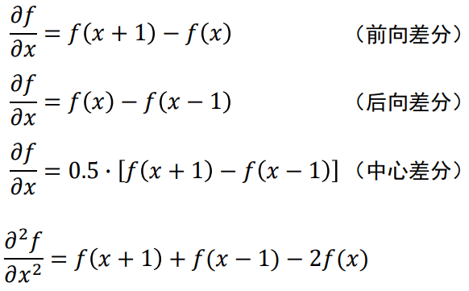
  
   一阶算子：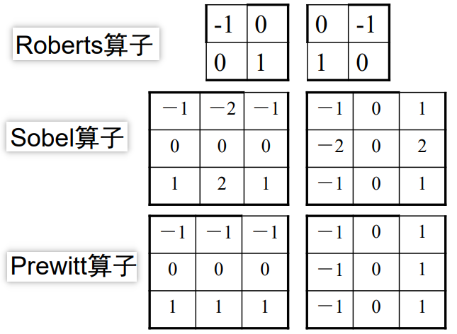
  
   Sobel算子相当于$[1,2,1][-1,0,1]^T$，先低通滤波，再中心差分，抑制噪声
  
   二阶：拉普拉斯算子

## 4. 频域增强

- 2D-DFT及其反变换

$$
F(u,v)=\sum_{x=0}^{M-1}\sum_{y=0}^{N-1}f(x,y)e^{-j2\pi(\frac{ux}{M}+\frac{vy}{N})}
\\
f(x,y)=\dfrac{1}{MN}\sum_{u=0}^{M-1}\sum_{v=0}^{N-1}f(u,v)e^{j2\pi(\frac{ux}{M}+\frac{vy}{N})}
$$

- 基本步骤
  
  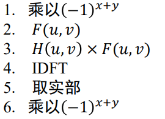

- 高通滤波，低通滤波，振铃效应

# 第6章 图像恢复

## 1. 降质模型

线性移不变系统 $G=HF+N$

## 2. 图像去噪（空域滤波、频率滤波）

## 3. 图像去模糊（逆滤波的原理及问题）

降质函数估计：通过观测图像估计、通过实验估计、通过数学建模估计
逆滤波：降质模型直接除以降质函数    问题：噪声影响（通过增加低通滤波）

## 4. 几何校正（插值方法）

最近邻赋值、双向线型插值、高阶插值

# 第7章 边缘检测

## 1. 边缘模型，边缘参数描述

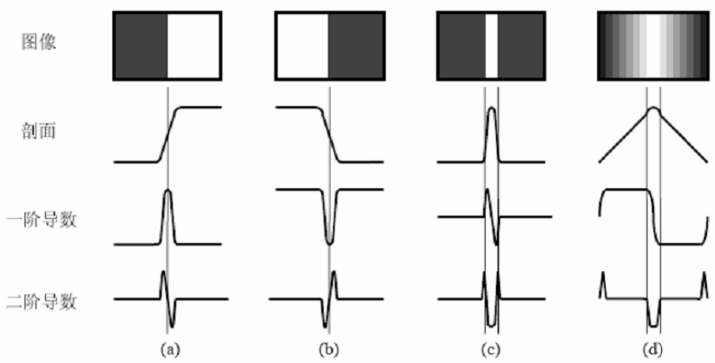

位置：边缘（等效的）最大灰度不连续处
朝向：跨越灰度最大不连续的方向（XY平面）
幅度：灰度不连续方向上的灰度差
均值：属于边缘的像素的灰度均值
斜率：边缘在其朝向上的倾斜程度

## 2. 边缘检测算子

正交梯度算子（Roberts、Prewitt、**Sobel**）

方向梯度算子（Kirsch模板：对特定方向）

二阶倒数算子：拉普拉斯算子，Marr算子（高斯低通，拉普拉斯，取过零点）

Canny算子（高斯低通，计算梯度大小方向，非极大值抑制/双阈值检测和连接）

SUSAN算子（核同值区）

# 第8章 图像分割

## 1. 图像分割定义

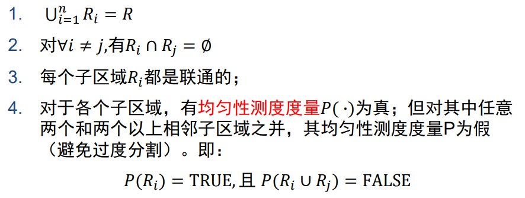

## 2. 传统分割方法

阈值分割（像素阈值、区域阈值、坐标阈值（变化阈值））

区域生长法（直方图选取种子，灰度差决定是否生长）

分裂合并法（非均匀则分裂，接着按同一父块合并，最后组合相邻）

分水岭分割算法（梯度图、由低到高填充）

聚类分割算法

1. **k-means**（需要指定k、复杂度高）

2. AP聚类（吸引度、归属度）
   
   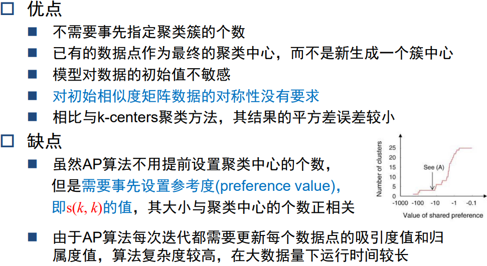

3. 彩色图像分割

## 3. 水平集分割的基本思想和优势

从曲线演化到水平集演化推导（内力：曲线光滑、外力：推动轮廓向边界移动）
通过最小化能量函数来引发曲线变化，使其向目标边缘逐渐逼近，最终找到目标边缘。这种动态逼近方法所求得的边缘曲线具有封闭、光滑等优点。

水平集优点：可以处理模型拓扑结构的变化。比如曲线的合并或分裂等

<mark>利用变分法和梯度下降法推导演化方程</mark>

如何基于演化实现图像分割

## 4. Graph Cut分割的基本思想

寻找最小割    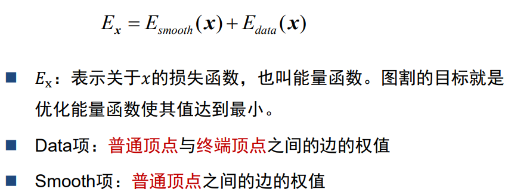 

# 第9章  图像表达与描述

## 1. 全局特征

 灰度直方图

Color Name（11种）

GIST（Gabor滤波器：正弦平面波叠加高斯函数）
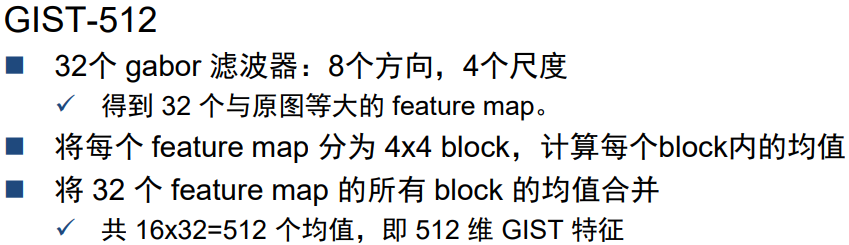

## 2. 简单局部特征

**LBP**：在像素3x3邻域内的，以邻域中心像素为阈值，将相邻的8个像素的灰度值与其进行比较，若周围像素值大于中心像素值，则该像素点的位置被标记为1，否则为0。这样，3x3邻域内的8个点经比较可产生8位二进制数（通常转换为十进制数即LBP码，共256种），即得到该邻域中心像素点的LBP值，并用这个值来反映该区域的纹理信息。
环状LBP：环形取样、非整数坐标则双线性插值
优点：对光照非常鲁棒
旋转不变性改进：不断旋转领域，取最小的LBP值（代价是牺牲了对不同模式的区分性）
等价模式改进：按照跳变数量 $2^P\rightarrow P(P-1)+2+(1)$ （减少特征维数、减少高频噪声影响）

**HOG**：统计图像局部区域的**梯度方向直方图**（8x8 cell  -> 9 bins -> block(4 cell)归一化）。

**形状上下文**（shape context）：提取物体轮廓，比较轮廓点相似性

## 3. 基于关键点检测的局部特征

- 基本框架（局部特征提取，特征编码，局部特征聚合）
  可重复性（局部特征不变性）、显著性、紧凑型和高效性、局部性

- 关键点检测：
  
  - **Harris角点**检测子推导过程
    滑窗中的灰度变化：特征值分析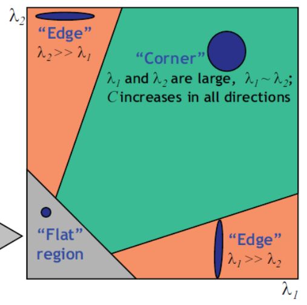
    角点响应函数 $R(x,y)=\lambda_1\lambda_2-\alpha\left(\lambda_1+\lambda_2\right)^2$ 建立阈值并取局部极大值
    有旋转不变性，不具有尺度不变性
  
  - 块检测
    **DoG**：使用不同大小的DoG滤波器与图像块卷积，卷积响应的极值确定了适合当前像素的尺度。
    **MSER**：对比不同阈值下的分割结果，构建分割树。对较大仿射畸变有较好的检测鲁棒性，但一副图象中检测得到的MSER区域数量有限。

局部区域描述方法： SIFT特征描述子生成方法

1. 主方向估计（一个图块可能有多个主方向

2. 旋转对齐

3. 图像分块：缩放到固定大小，分为4x4小块

4. 梯度方向直方图提取：逐块计算8D梯度直方图

5. 特征拼接&归一化
- 视觉特征不变性内涵，SIFT如何实现（亮度、平移、旋转、缩放变换）不变性；

- 图像发生灰度变换（如反色）后，其SIFT特征如何变化：数量、位置、尺度不变，主方向和128描述子旋转180°

**BOW**（词袋模型）：

1. 对大量视觉特征聚类形成视觉码本

2. 将局部视觉特征量化到最近的视觉单词

3. 对图片中的所有视觉特征构建视觉单词直方图

**VLAD**：通过聚类方法训练一个小的码本，对于每幅图像中的特征找到最近的码本聚类中心，随后所有特征与聚类中心的差值做累加，得到一个k\*d的vlad矩阵，其中k是聚类中心个数，d是特征维数(如sift是128维),随后将该矩阵扩展为一个(k*d)维的向量，并对其L2归一化，所得到的向量即为VLAD

**PQ**（乘积量化）原理：对特征空间进行极度精细的划分，减小量化误差。方法：将特征向量划分为子向量。

# 第10章 图象识别

## 1. 形状识别

**Hough变换**

- 原理：将图像空间$(x,y)$转变到Hough参数空间 $\lambda=x\cos\theta+y\sin\theta$

- 直线检测：参数空间的交点代表一条直线

- 圆周检测：利用梯度降维（圆周圆心在圆周边缘点的梯度方向上）
  $a=x-r\sin\theta\space\space\space b=y+r\cos\theta$
  每个边缘点映射到霍夫空间都是一个半径为$r$的圆，使$r$不断变化，并在参数空间做累加，最大的点代表图像空间的圆心和半径。

- 椭圆检测
  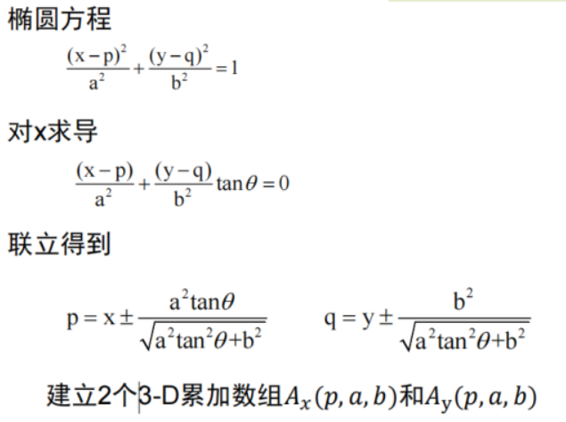

- 广义Hough变换
  先对模板与图象上的物点作坐标变换，然后求相关

距离变换及Chamfer Distance
先边缘检测，接着作距离图，然后以匹配形状作为模板，遍历求和，最小位置为匹配点

## 2. 人脸检测与识别方法基本思想，一般目标检测基本思想<mark> ?</mark>

## 3. 图像分类

- SPM（空间金字塔匹配）

- KNN&SVM

## 4. 图像检索

倒排索引
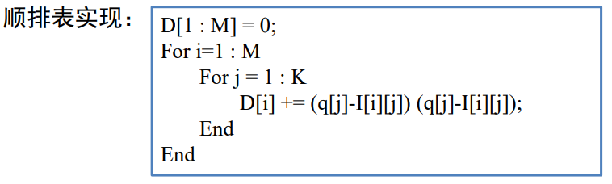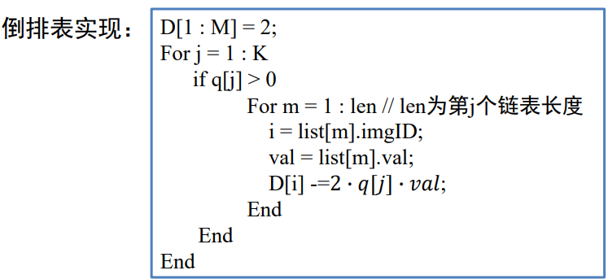

几何校验

- RANSAC（匹配的特征点随机取样作仿射变换）

- 空间编码（x和y方向分辨按相对位置编码，求异或，最大的不匹配）

## 5. 二值哈希基本思想

减小了存储开销加快了检索速度
两个二进制数求异或，比特位为1的个数即为汉明距离

# 第11章  概率图模型

链式法则：$P(x_1,\cdots,x_N)=P(x_1)\prod\limits_{i=2}^N P(x_i|x_1,\cdots,x_{i-1})$

## 1. 概率有向图模型（贝叶斯网络）

- 因子分解：概率有向图表示的联合概率分布可表示为图中每个结点在其父节点给定时的条件分布的乘积

- 条件独立性 $p(a,b|c)=p(a|c)p(b|c)$ 记作 $a\perp b\text{|}c$ 
  阻断形式：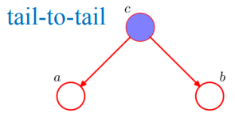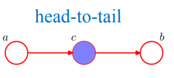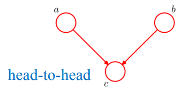

- 马尔可夫毯：一个结点的马尔可夫毯是使该结点与图中所有其他结点独立所需要观察到的最小结点集合

## 2. 概率无向图模型（马尔可夫随机场）

- 成对马尔可夫性：定义:给定随机变量组$Y_O$的条件下，随机变量$Y_u$和$Y_v$是条件独立的

- 局部马尔可夫性：$W$是与$v$有边相连的所有结点，$O$是其他所有结点，给定随机变量组$Y_W$的条件下随机变量$Y_v$与随机变量$Y_O$是独立的

- 全局马尔可夫性：结点集合$A$，$B$是在无向图$G$中被结点集合$C$分开的任意结点集合，给定随机变量组$Y_C$的条件下随机变量$Y_A$与随机变量$Y_B$是独立的

- 如果联合概率分布$P(Y)$满足成对、局部或全局马尔可夫性，就称此联合概率分布为概率无向图模型或马尔可夫随机场

- 因子分解：将概率无向图模型的联合概率分布表示成最大团上的随机变量的函数的乘积形式 $\begin{aligned}P(Y)&=\frac{1}{Z}\prod_C\psi_C(Y_C)\\ \end{aligned}$

## 3. 条件随机场

- 线性链条件随机场的定义与形式
  给定随机变量$X$条件下，随机变量$Y$的马尔可夫随机场

- 概率计算 *P876*
  $$
  P(Y_i=y_i|x)=\dfrac{\alpha_i^T(y_i|x)\beta_i(y_i|x)}{Z(x)}
  \\
  P(Y_{i-1}=y_{i-1},Y_i=y_i|x)=\dfrac{\alpha_{i-1}^T(y_{i-1}|x)M_i(y_{i-1},y_i)\beta_i(y_i|x)}{Z(x)}
  \\
  {Z(x)=\alpha_n^T(x)\textbf{1}}
  $$

- 预测算法：维特比算法
  假设求A-E的最大概率；先求A-B的所有概率；对每个C求A-C的最大概率，抛弃不是最大值的B；接着对每个D求A-D的最大概率，抛弃不是最大值的C；最后求到E的最大概率。

# 第12章 运动分析

## 1. 相机运动建模

## 2    光流定义，光流方程推导以及二义性问题

## 3    运动表达方法：全局、基于像素、基于块、基于区域

## 4    运动参数估计准则

## 5    运动参数估计方法

## 6    穷举块匹配算法(MBMA)，层级块匹配算法(HBMA)

# 第13章 目标跟踪

## 1    单目标跟踪

贝叶斯跟踪框架

粒子滤波跟踪基本原理

均值漂移跟踪基本原理

# 第14章  基于深度学习的图象分析

## 1    基本概念

前馈神经网络，卷积神经网络，循环神经网络

## 2    图像分类的经典模型

AlexNet, VGGNet, GoogLeNet, ResNet, DenseNet, MobileNet

注意力机制及Transformer

# 还没整理完……
