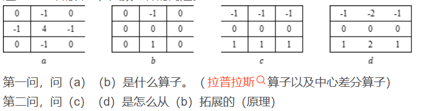

### 连通悖论（17、19、22）

4邻域和8邻域，4连通和8连通。同时有两种邻域的定义和两种连通性导致了对连通的歧义性，这称为连通悖论。  解决方法内4边8，内8外4。

### Marr算子，Canny算子（17）

### 2种常见的拉普拉斯模板，Marr（马尔）算子和拉普拉斯变换联系和实现（22）

### sobel和marr算子是什么，为什么体现了低通滤波。（22）

### Canny算子和SUSAN算子如何定义边缘点（19、20）

### canny算子中非极大值抑制和双阈值检测和连接的作用（21）

### 形态学实现模板（考的击中击不中变换，看图猜变换）（22）

### 二维理想的低通滤波函数，为什么引发振铃现象，高斯的低通滤波器如何消除振铃现象的（22）

### 逆滤波原理，逆滤波缺点和解决方法（22）

### 从集合角度分析图像分割原理，参数化主动轮廓模型的图像分割以及level set的好处（22）

### susan算子的步骤（18、19、20）

### 灰度共生矩阵 纹理（17）

### 灰度插值的2种方法和灰度估计3种手段，各自有什么优缺点（22）

### 给模板和图像，求腐蚀、开启（17）

### 给模板求距离变换、Chamfer Distance（17、19、20）

### 数字化模板，上下左右距离是3，角上距离是4，给定中心，求一个模板化距离。以及为什么要求这个（22）

### 求链码及消除影响因素（17）

### 求链码和形状数（18、19）

第一小题，给你一个图，让你写出它的链码，计算出形状  
第二小题，形状数能消除起点选择、旋转变换、尺度变换这三种影响中的那几个因素。

第一小题在PPT第七章6-9页，第八章8-11页。  
第二小题是可以消除起点选择和旋转变换，从第一小题的那两章PPT就能看懂了。

### 局部二值的模式，梯度方向直方图，以及反色之后的变化（22）

### 灰度直方图，LBP，HOG，SIFT在反色、旋转180°情况下的不变性（22）

### SIFT不变性及反色后的描述子变化（17、18、19、20、21）

第一小题，谈谈你对图像特征不变性的理解  
第二小题，SIFT特征子如何实现特征不变性
SIFT的四个不变性解释。（平移，尺度，旋转，亮度）

SIFT描述子如何实现平移，旋转不变性，尺度不变性，亮度不变性

第三小题，反色(f(x)=255-x）后的SIFT特征发生了什么变化

基于空间编码的几何校验的过程原理步骤

### 运动分析的四大准则，以及四大准则之间的联系（22）

### 视觉表达不变性和区分性（21）

不变性和区分性定义

LBP HOG 灰度直方图 的不变性

提高灰度直方图区分性的一种方法

### 光流方程推导，多义性（17、18、19、20）

第一小题，于灰度不变假设，光流方程的二维运动推导  
第二小题，为啥在平滑图像区域光流方程的效果不好。

光流方程在什么情况下不能确定（二义性的部分）

### 水平集流程、优势，演化方程推导，变分法（17、18、19、20）

图像分割的定义

第一小题，问你水平集的基本思想  
第二小题，变分法推导，就是PPT上的东西

### 水平集作用，公式推导（不是变分法，而是另外一个FN的公式）。（22）

### 聚类分析，kmeans方法计算（18）

### 给了两个模板，求相应的连续算子是什么（其中一个是拉普拉斯算子）（18）

考点：离散空域滤波模板与线性算子对应关系

### sobel算子拓展原理，以及拓展后的优势（18、19、20）

### 考腐蚀膨胀开启闭合（19、20）

给你两个图，问你怎么从第一个图到第二个图。

这个定义我觉得书中挺详细的，285页-290页，301页-306页。
PPT在第十二章4、6、18页，39-47，知识点的东西说起来复杂，理解起来很快，看呗。

重点是应用算法，也就是PPT的39-47页，这道题考的就是噪声消除和边界提取。

### sift描述子的维数如何定义及各维数的含义，shape context描述子的维数如何定义及各维数的含义（18）

### 数字弦的判定（19）

在方格图中给你两条弦，让你判断是否是数字弦

### Hough变换（19、20、22）

第一小题，经过一个焦点坐标(x1,y1)的所有椭圆，经过Hough变换后参数空间(x2,y2,C)构成的几何形状是什么。其中(x2,y2)是另一个焦点坐标。  
第二小题，一个圆环的图像呗噪声污染，问你基于图像梯度，如何利用Hough变换检测圆，并写出基本步骤。

基于y=kx+b如何实现霍夫变换检测出来直线，有何缺点，以及替换霍夫变换的方法

### 直方图（20）

第一问，为了增强图像表达能力，需要将图像进行划分，说两种图像划分方法的名称（三角形网络 六边形网络）  
第二问，给一个patch，说明LBP直方图与梯度方向直方图的原理（如何构建直方图），并分别说明有哪些灰度不变性。

### 深度卷积神经网络（20）

第一问，卷积在训练测试时的作用
第二问，最大池化在 $L_p$ 范数中 $p$  取什么值，你认为是否可以将最大池化层改成 $p$ 可学习的 $L_p$ 范数

### VJ人脸检测中利用了积分图提高效率，写出积分图基本思想（21）

### 深度学习，求取误差项（22）

### 深度学习。卷积神经网络参数数量及计算复杂度估计。以及1*1的卷积器有什么作用。（22）

### 2D DFT变换的基本性质。大概就是f(ax,by)对应的函数和F(u,v)的关系是什么（22）

### 相机运动建模。描述跟、吊、摇……等行为需要多少个参数（22）

### 倒排索引（22）

### 目标跟踪。卡尔曼为什么不给力？粒子滤波为什么给力？从原理上讲一下（22）

