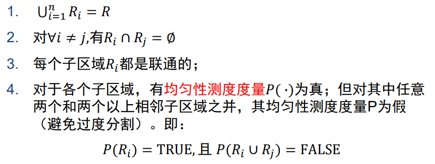

### 连通悖论（17、19、22）

4邻域和8邻域，4连通和8连通。同时有两种邻域的定义和两种连通性导致了对连通的歧义性，这称为连通悖论。  解决方法：内4边8或内8外4。

### 数字弦的判定（19）

在方格图中给你两条弦，让你判断是否是数字弦

数字弧： $p\rightarrow q$ 连续
数字弦： $d_8(\rho,p_k)<1$ 
紧致数字弦： $d_4(\rho,p_k)<1$

### 链码（17、18、19）

1. 根据图，写出它的链码，计算出形状数 
   链码 [7,7,8,8,2,2,8,8,8,3,3,3,5,5]（图不全）
   [求差分码再求形状数](https://www.bilibili.com/opus/765142166218473505)

2. 形状数能消除起点选择、旋转变换、尺度变换这三种影响中的哪几个因素
   能消除起点选择和旋转变换

### 2D DFT变换的基本性质（22）

 $f(x,y)$ 经过DFT得到 $F(u,v)$ 则 $f(ax,by)$ 经过DFT得到什么？

 $f(ax,by)\Leftrightarrow F(u/a,v/b)$

### 腐蚀膨胀开启闭合（17、19、20）

闭运算、开运算、边界提取（先腐蚀一个像素、然后拿原图减腐蚀结果）

### 二维理想的低通滤波函数，为什么引发振铃现象，高斯的低通滤波器如何消除振铃现象的（22）

频域的冲激函数转换到空域是sinc函数。理想低通滤波操作在频域 相乘则转化到空域成为卷积操作。当sinc函数在空域卷积，则造成振铃线性。高斯低通滤波器转换到空域依然是高斯函数。

### 逆滤波原理，逆滤波缺点和解决方法（22）

估计降质函数，将降质模型直接除以降质函数，得到原图估计。
缺点：仍然具有噪声影响。
解决方法：增加低通滤波

### 灰度插值的2种方法和灰度估计3种手段，各自有什么优缺点（22）

- 灰度插值
  
  - 前向映射
  
  - 后向映射

- 灰度估计
  
  - 最近邻赋值（计算简单，结果一般可以接受，但细节处质量差）
  
  - 双向线型插值（计算稍复杂，结果比零阶插值好，虽然在边界处是连续的，但
    是其导数不连续）
  
  - 高阶插值（计算复杂，可以克服边界处导数的不连续性）

### 两种常见的拉普拉斯模板（22）

### Marr算子是什么，和拉普拉斯的联系，为什么体现了低通滤波（22）

1. 先用一个2-D的高斯平滑模板与源图象卷积（体现了低通滤波）

2. 计算卷积后图象的拉普拉斯值

3. 检测拉普拉斯图象中的过零点作为边缘点

因为卷积和拉普拉斯变换都是线性操作，因此可以将前两步的算子先合成，Marr算子可视为拉普拉斯和高斯卷积核的相乘。

### Prewitt算子和Sobel算子是如何从中心差分算子拓展的，拓展后的优势，为什么体现了低通滤波（18、19、20、21）

Prewitt算子和Sobel算子可视作[1,1,1]和[1,2,1]分别与中心差分算子得到的，因此体现了低通滤波。优势是抑制噪声对于梯度的计算影响。

### Canny算子和SUSAN算子如何定义边缘点（17、19、20）

- Canny算子先使用高斯低通降噪，再计算梯度大小及方向，在梯度方向上进行非极大值抑制与双阈值检测和连接，得到边缘点。

- SUSAN算子使用核同值区模板遍历图像，模板中统计高于和低于模板中心的像素数量，两者数量相当的为边缘点。

### SUSAN算子的步骤（18、19、20）

SUSAN算子使用核同值区模板遍历图像，模板中统计高于和低于模板中心的像素数量，两者数量相当的为边缘点。

### Canny算子中非极大值抑制和双阈值检测和连接的作用（21）

- 非极大值抑制：细化边缘

- 双阈值检测和连接：以强边缘作为基础、在弱边缘中选择像素进行连接，使得结果更加精确，减少了结果边缘的间隙。

### 形态学实现模板（考的击中击不中变换，看图猜变换）（22）

### 聚类分析，kmeans方法计算（18）

### 从集合角度分析图像分割原理（22）

### 从曲线演化到水平集演化（22）

### 水平集流程、优势，梯度下降法和变分法推导演化方程（17、18、19、20、21、22）

- 流程：

- 优势：易于对目标进行描述、亚像素的精度、易于融入各种信息、成熟的数学工具、能够处理复杂的拓扑结构

- 梯度下降法：

- 变分法：

### 直方图（20、22）

第一问，为了增强图像表达能力，需要将图像进行划分，说两种图像划分方法的名称
第二问，LBP直方图与HOG直方图的原理（如何构建直方图），并分别说明有哪些灰度不变性，以及反色、旋转180°情况下之后的变化。

1. 区域生长法、分裂合并法、分水岭分割算法、聚类分割算法……

2. 局部二值模式（LBP）在3x3的窗口内，以中心像素为阈值，将相邻8个像素的灰度值
   与中心像素比较，大于等于置1，小于置0，得到8位二进制数作为LBP值。具有光照不变性。旋转不变性：采取LBP等价模式。（反色则取反，旋转180°不变）

3. 梯度方向直方图（HOG）将cell内的像素灰度统计到梯度方向上进行累加。对有重叠的block进行归一化，拼接block向量得到HOG。（反色不变，旋转180°直方图左右颠倒）

### SIFT不变性及反色、旋转180°情况下后的描述子变化（17、18、19、20、21、22）

- SIFT的四个不变性解释。（平移，尺度，旋转，亮度）

### 视觉表达不变性和区分性（21）

- 不变性和区分性定义

- LBP HOG 灰度直方图 的不变性
  LBP：光照不变性、旋转不变性
  HOG：对几何和光学变化都有很好的不变性、不具有旋转不变性和尺度不变性

- 提高灰度直方图区分性的一种方法

### SIFT描述子的维数如何定义及各维数的含义，Shape Context描述子的维数如何定义及各维数的含义（18）

- 形状上下文：以某个轮廓点作为参考原点统计其他轮廓点的分布。4维度：轮廓点、其他轮廓点距离（取对数）、其他轮廓点方向、其他轮廓点数量。

### 基于空间编码的几何校验的过程原理步骤

### Hough变换（19、20、22）

第一小题，经过一个焦点坐标(x1,y1)的所有椭圆，经过Hough变换后参数空间(x2,y2,C)构成的几何形状是什么。其中(x2,y2)是另一个焦点坐标。  
第二小题，一个圆环的图像呗噪声污染，问你基于图像梯度，如何利用Hough变换检测圆，并写出基本步骤。

基于y=kx+b如何实现霍夫变换检测出来直线，有何缺点，以及替换霍夫变换的方法

### VJ人脸检测中利用了积分图提高效率，写出积分图基本思想（21）

### 给模板求距离变换、Chamfer Distance（17、19、20）

### 数字化模板，上下左右距离是3，角上距离是4，给定中心，求一个模板化距离。以及为什么要求这个（22）

### 倒排索引（22）

### 相机运动建模。描述跟、吊、摇……等行为需要多少个参数（22）

### 光流方程推导，多义性（17、18、19、20）

第一小题，于灰度不变假设，光流方程的二维运动推导  
第二小题，为啥在平滑图像区域光流方程的效果不好。

光流方程在什么情况下不能确定（二义性的部分）

### 运动分析的四大准则，以及四大准则之间的联系（22）

### 目标跟踪。卡尔曼为什么不给力？粒子滤波为什么给力？从原理上讲一下（22）

### 深度卷积神经网络（20）

第一问，卷积在训练测试时的作用
第二问，最大池化在 L_p 范数中 p 取什么值，你认为是否可以将最大池化层改成 p 可学习的 L_p 范数

### 深度学习，求取误差项（22）

### 深度学习。卷积神经网络参数数量及计算复杂度估计。以及1*1的卷积器有什么作用。（22）

### 

### 

### 

